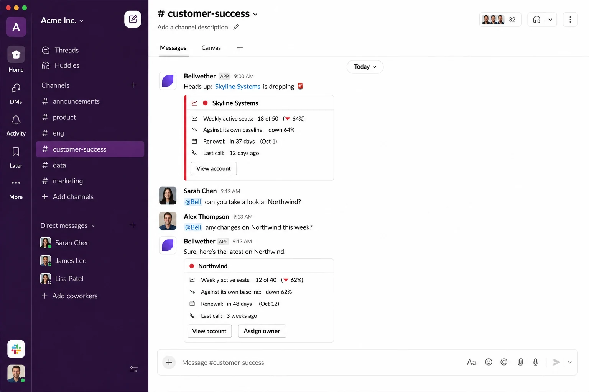

<div align="center">


<h1>Bellwether</h1>

<p><strong>Know before they leave.</strong></p>

<p>
An open-source context layer for customer success teams.<br>
It watches your accounts, notices when one starts slipping, and explains <em>why</em> — with sources —<br>
right where your team already works.
</p>

<p>
<a href="LICENSE"></a>
<a href="docs/deploy.md"></a>
<a href="#five-ways-in"></a>
<a href="https://github.com/Mo3azAqeed/bellwether/stargazers"></a>
</p>

<p>
<a href="https://thebellwether.tech"><strong>Website</strong></a> ·
<a href="docs/">Documentation</a> ·
<a href="https://thebellwether.tech/roadmap/">Roadmap</a> ·
<a href="https://thebellwether.tech/use-cases/">Use cases</a> ·
<a href="https://github.com/Mo3azAqeed/bellwether/issues">Issues</a>
</p>



</div>

---

## The whole product, in two messages

Nobody asked for this one. It arrived because the numbers moved:

```
⚠️  Northwind's health tier just dropped — Stable → Watch

🔴 Northwind
Not great. Usage has been pulling away and it's down 52% against its own baseline.

Active seats (10-day avg)   Against baseline   Renewal        Owner
4 of 12                     -52%               in 23 days     Maya

[View account]  [Assign owner]  [Why?]
```

Then you ask the question a dashboard can't answer:

```
@Bell why is Northwind declining?

Northwind: Their admin champion left in August and the replacement hasn't
been onboarded yet [1]. Support also flagged a blocked SSO renewal that's
stopping new users from logging in [2].

Sources:
• zoom · 2026-08-14: "...our admin Sarah actually left the company last month..."
• intercom · 2026-08-22: "SSO cert expired, blocking new logins for..."
```

Those citations are numbered to match the `[1]` markers in the answer, each
carries the record's own words, and **each links back to the record it came
from** — the actual Zoom recording, the actual Intercom conversation,
the actual Salesforce task. You can open the evidence and disagree with it
mid-call. Bellwether answers only from what it actually retrieved, and when
nothing relevant has been ingested it says so instead of writing something
plausible. Where a source has no linkable record, the citation stays plain
text rather than pointing at a 404 — [how that resolves](docs/connectors.md#following-a-citation-back-to-the-record).

## Show your working

"It shows its sources" is easy to write and hard to mean. Three things back
it up, and each is a thing you can open rather than a claim:

- **Citations are verbatim.** The answer quotes the record, and the quote is
  checked against what was actually retrieved. A quote the model invented is
  flagged rather than printed.
- **Every claim has an address.** A citation links to the Zoom recording, the
  Intercom conversation, the Zendesk ticket. Where a source has no linkable
  record, it stays plain text rather than pointing at a 404.
- **You can ask how it got there.** `explain_answer` replays a specific
  answer: which excerpts retrieval picked, how each one scored, which model
  wrote it, and — if you ask — the literal prompt it was given.

The same history renders as a vertical timeline, in the browser, in Slack, or
in your terminal. [docs/timeline.md](docs/timeline.md)

## It drafts, you decide

Bellwether reads everywhere else. Filing an engineering ticket is the one
place it writes into someone else's system, so it cannot do it on its own.

Every path that can propose a ticket writes to Bellwether's own table and
nowhere else. Filing is a separate step that takes a draft id, requires an
approver's name, and files the text that person read — verbatim, no
regeneration between approval and creation. Linear and Jira both supported.

That's the shape of the code, not a setting. [docs/tickets.md](docs/tickets.md)

## Why it exists

Customer success tooling is mostly built for the person reporting on the
team, not the person on the call. It shows up as another dashboard, in
another tab, that nobody opens on the day it would have mattered.

Bellwether starts from the opposite end. Three things follow from that:

- **It comes to you.** Slack, Teams, or your editor — no new surface to
  check, no login to remember.
- **It compares each account to its own history**, not to a generic
  benchmark. A team that has always used 8 of 40 seats isn't in trouble; a
  team that used 30 last month and uses 12 now is, and only one of those two
  facts is visible in a seat count.
- **It shows its sources.** Every "why" answer cites the transcript or
  ticket it came from, so you can disagree with it.

And it's yours: MIT licensed, deployed into your own infrastructure, with no
account to create, no seat pricing, and no vendor — including us — sitting
between you and your customers' data.

## Quickstart

You'll need a Cloudflare account, a Slack workspace or Microsoft 365 tenant,
and a PostHog or Mixpanel project that receives your product usage.

```bash
git clone https://github.com/Mo3azAqeed/bellwether.git
cd bellwether/worker && npm install && npx wrangler login

npx wrangler d1 create bellwether
npx wrangler vectorize create bellwether-context --dimensions=768 --metric=cosine
# paste the printed database id into wrangler.jsonc, then:
npm run db:migrate:remote
npx wrangler secret put SETUP_ADMIN_TOKEN
npm run deploy
```

Then open `https://<your-worker>/setup` and connect your tools one at a
time — each credential is tested against the real service before it's saved.
Prefer a terminal? `npm run setup` is the same thing without the browser.

Full walkthrough, including the Slack app and Teams bot: **[docs/deploy.md](docs/deploy.md)**.

> **Or have an agent do it.** [`AGENTS.md`](AGENTS.md) is a deploy playbook
> written for Claude Code, Cursor and Codex. Point one at this repo and ask
> it to set Bellwether up — it will create the database, set the secrets,
> deploy, and walk you through the credentials it can't get on its own, the
> way `dbt init` walks you through a project.

## Five ways in

Same brain behind all of them — `src/bot-logic.ts` resolves the question
once, so no two front ends can answer it differently.

| Where | What it's for | Setup |
|---|---|---|
| **Slack** | `@Bell how is Northwind doing?`, plus unprompted alerts when a tier changes | [Deploy, step 6](docs/deploy.md) |
| **Microsoft Teams** | The same bot, same cards, for teams that don't live in Slack | [Deploy, step 6](docs/deploy.md) |
| **Your coding agent** | Claude Code, Cursor, Codex and OpenCode reach the same context over MCP — nine tools, and only one of them spends a model call | [docs/mcp.md](docs/mcp.md) |
| **Plain files** | `npm run context:pull` writes the whole context layer to markdown you can read, grep and diff | [docs/context-files.md](docs/context-files.md) |
| **A timeline** | One vertical axis showing where every piece of context came from — as a page, as `/timeline <account>` in Slack, or as an MCP tool in your terminal | [docs/timeline.md](docs/timeline.md) |

## What it plugs into

| | |
|---|---|
| **Product usage** | PostHog, Mixpanel |
| **Call transcripts** | Fireflies, Zoom, Google Meet |
| **Support** | Intercom, Zendesk |
| **CRM** | HubSpot, Salesforce, Attio |
| **Anything else** | `POST /ingest` takes plain text and a date — a Make/n8n/Zapier automation or a one-off script is enough |

Webhook-driven sources land within minutes; the CRMs and Google Meet backfill
on a schedule you pick. What that does and doesn't guarantee is written out
honestly in [docs/connectors.md](docs/connectors.md#how-data-stays-fresh).

## How it works

```
       your tools                    Bellwether                    your team
┌──────────────────────┐      ┌────────────────────────┐      ┌──────────────────┐
│  PostHog / Mixpanel  │usage→│  baseline + tiering    │─────→│  Slack / Teams   │
│                      │      │  10 days vs 49 days    │      │  cards + alerts  │
│  Fireflies / Zoom    │      ├────────────────────────┤      ├──────────────────┤
│  Intercom / Zendesk  │─text→│  chunk → embed →       │─────→│  Claude Code,    │
│  HubSpot / SF / Attio│      │  retrieve → cite       │      │  Cursor, Codex   │
└──────────────────────┘      └────────────────────────┘      └──────────────────┘
                   Workers · D1 · Vectorize · Workers AI · Cron
                          in your own Cloudflare account
```

`how is X doing?` computes usage live against that account's own 10-day vs
49-day baseline. `why is X declining?` retrieves the most relevant ingested
notes and has a model answer from those alone. A cron run recomputes every
account on your chosen interval, so history accumulates for the accounts
nobody asked about — and so tier-change alerts fire without anyone watching.

More detail: [docs/architecture.md](docs/architecture.md).

## What it costs

| | |
|---|---|
| Workers, D1, Workers AI | Free at this scale — and the AI models are included |
| Vectorize | Needs the **$5/mo Workers Paid plan**; it isn't on the free tier |

So **$0/month** without the transcript and "why" features, **$5/month** with
them — flat, not per account or per seat. The platforms this sits next to
quote $30K+/year.

You can also bring your own model key (OpenRouter, Anthropic) if you want
better answers than the free default. Which calls cost what, and how to run
the reasoning layer on something cheap like DeepSeek, is laid out in
[docs/mcp.md](docs/mcp.md#who-pays-for-what-bring-your-own-key).

## Self-hosted by construction

There is no Bellwether-run backend. Not "we don't look at your data" — there
is nowhere for it to go. Every deployment is a clone running in your own
Cloudflare account: your Slack token, your PostHog project, your database,
your vector index. Nobody else, including whoever wrote this code, can reach
any of it.

That's a claim you can check rather than trust. This repo is the entire
system; nothing in it calls home.

## Documentation

| | |
|---|---|
| [Deploy](docs/deploy.md) | From an empty Cloudflare account to `@Bell` answering |
| [Connect your tools](docs/setup.md) | The setup wizard and the CLI |
| [Context sources](docs/connectors.md) | Every connector, and how fresh each one is |
| [Coding agents (MCP)](docs/mcp.md) | Claude Code, Cursor, Codex, OpenCode — and who pays for what |
| [Context as files](docs/context-files.md) | The whole layer as markdown on disk |
| [Account timeline](docs/timeline.md) | Where every piece of context came from, in order |
| [Engineering tickets](docs/tickets.md) | Drafting a Linear or Jira ticket from account context |
| [Configuration](docs/configuration.md) | Every variable, and where it can be set |
| [Architecture](docs/architecture.md) | What each piece does, and the repo layout |
| [Local development](docs/development.md) | Running and changing it |

## Status

**v0.1, soft launch.** It's deployed and in real use, and the core — health
tiers, alerts, the cited "why" flow, Slack, Teams, MCP — is stable enough to
rely on. Some edges are newer than others, and it's better to say which:

- The **Salesforce and Attio** connectors are built against both vendors'
  current APIs but haven't yet been run against a live org. If you're the
  first, an issue either way would genuinely help.
- **Ticket filing** is the newest thing here and the only one that writes
  outward. Both providers are implemented from published API docs and have
  not been run against a live workspace, so point it at a throwaway project
  the first time. The draft-and-approve path around it is well covered by
  tests; the two HTTP calls at the end are not.
- **Google Meet** is backfill-only and Workspace-only; the caveats are in the
  connector's own source.
- Tests cover the logic that's easy to get quietly wrong (health tiering,
  chunking, VTT parsing, MCP framing, account identity, context rendering).
  There's no CI yet — `npm test` and `npm run typecheck` are the check.

What's planned, and what's deliberately not, is on the
[roadmap](https://thebellwether.tech/roadmap/).

## Contributing

Issues and pull requests are welcome, and small ones are the most welcome of
all — a connector for a tool we don't support, a wrong assumption in the
health tiering, a doc page that lied to you.

Before opening a PR, run `npm test`, `npm run typecheck` and
`npm run typecheck:scripts` in `worker/`. [CONTRIBUTING.md](CONTRIBUTING.md)
covers what a good PR looks like; [docs/development.md](docs/development.md)
has the conventions, including the shape every connector follows.

No CLA, no contributor agreement to sign. It's MIT; that's the whole deal.

Found something exploitable? [SECURITY.md](SECURITY.md) — by email, not in a
public issue.

## License

[MIT](LICENSE) — use it, fork it, run it for your own customers, sell
services around it. Built by people who got tired of finding out too late.
